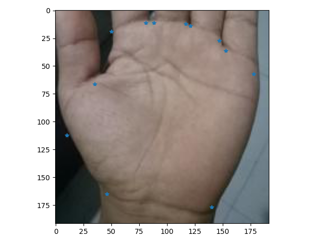
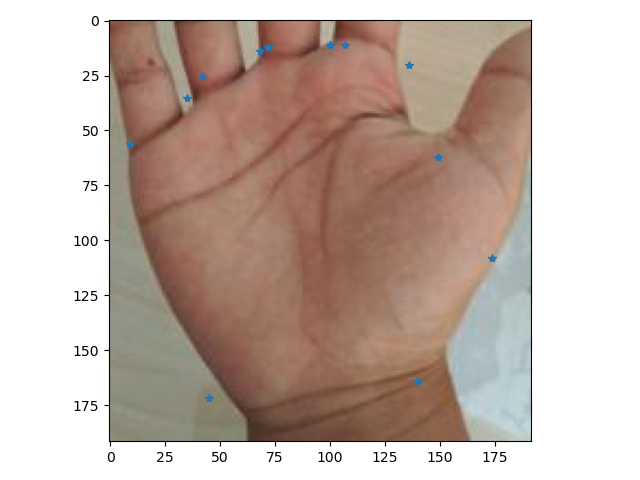

# 手掌定位与分类
## 手掌定位
使用resnet18作为backbone,输入为在原图上关键点所在矩形框padding 100px之后crop 并resize到192的图

## 定位部分代码说明

1. 训练代码：./train_net/my_train.py(数据读取也在这里)
2. 测试代码：test_image.py，有两个地方有这个文件，没有区别，看懂一个就能看懂第二个
3. 模型代码：./trane_net/models.py
4. 其他文件：
    1. tools：这个文件夹里面是MTCNN论文中的代码，你不需要看这个文件夹，如果在其他代码中发现有import这个文件夹中的代码就看一下
    2. model_store: 模型保存的地方
——————————————————————————————————————————————————

## 手掌分类部分代码说明
在classification中
这部分你只需要看以下的文件：
1. model_child_cls.py 以这个命名的代码区别在于类别不一样， 你只需要看懂一个就行
2. palm_dataloader.py & palm_dataloader_child.py 这是数据加载的地方，第一个是大类的数据读取，第二个是小类的数据读取
3. test.py & test_child.py 这是测试部分的代码
4. train_child_cls.py 这里你只需要看一个，训练部分的代码
5. function是指标计算的代码
6. utils.py 我代码中的这个文件都不需要单独打开看， 当你在其他代码中遇到需要使用这部分代码再看
### 如何确定标签

1. 首先确定一个覆盖所有类别的字典
2. 然后根据不需要的类别(这个得与数据集匹配)筛选出需要的字典，并且按照顺序排序，确定每个类别的标签

---
举个例子：
在大类分类中，所有类别为 1,2,3……9
但是我不需要2 6 9 这三个类别(只需要1,3,4,5,7,8),所以经过匹配后的字典为：  

{  
    "1": 1,  
    "3": 2,  
    "4": 3,  
    "5": 4,  
    "7": 5,  
    "8": 6       
}

